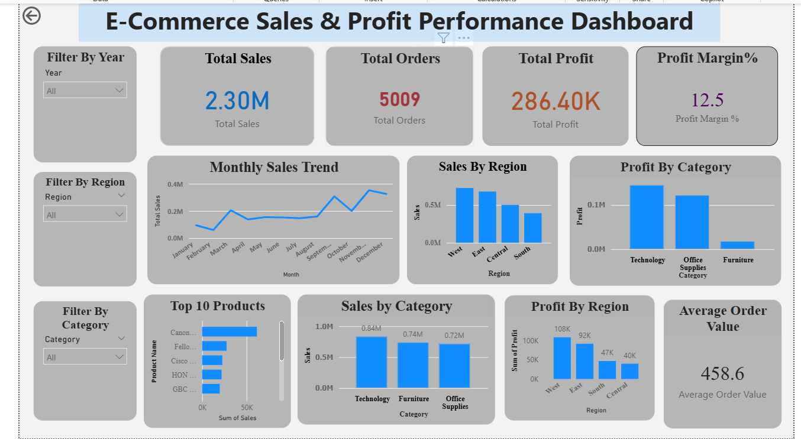

# E-Commerce Sales & Profit Performance Dashboard (Power BI)

## Project Overview

This project presents an interactive **Power BI dashboard** designed to analyze e-commerce sales performance and profitability.
The dashboard helps businesses understand key metrics such as total sales, profit trends, regional performance, and top-performing products.

By visualizing the data, this dashboard enables quick insights into business performance and supports data-driven decision making.

---

## Key Metrics

* **Total Sales:** 2.3M
* **Total Orders:** 5009
* **Total Profit:** 286.4K
* **Profit Margin:** 12.5%

---

## Dashboard Features

The Power BI dashboard includes the following visualizations:

* Monthly Sales Trend Analysis
* Sales Distribution by Region
* Profit by Product Category
* Top 10 Products by Sales
* Average Order Value
* Interactive Filters for Year, Region, and Category

These features allow users to explore the data dynamically and identify important business insights.

---

## Tools Used

* **Power BI Desktop** – Data visualization and dashboard creation
* **Data Analysis** – Identifying sales and profit patterns
* **Data Visualization Techniques** – Charts, filters, and interactive visuals

---

## Dashboard Preview

---

## Key Insights

* The **Technology category** generates the highest profit.
* The **West region** shows strong overall sales performance.
* The overall **profit margin is approximately 12.5%**.
* Sales trends indicate seasonal fluctuations throughout the year.

---

## Project Files

* `ecommerce-sales-dashboard.pbix` → Power BI dashboard file
* `dashboard.png` → Dashboard preview image
* `README.md` → Project documentation

---

## How to Use

1. Download the **.pbix file** from this repository.
2. Open the file using **Power BI Desktop**.
3. Explore the dashboard visuals and interact with filters to analyze the data.

---

## Author

**Snehitha**
Aspiring Data Analyst | Power BI | Data Visualization
